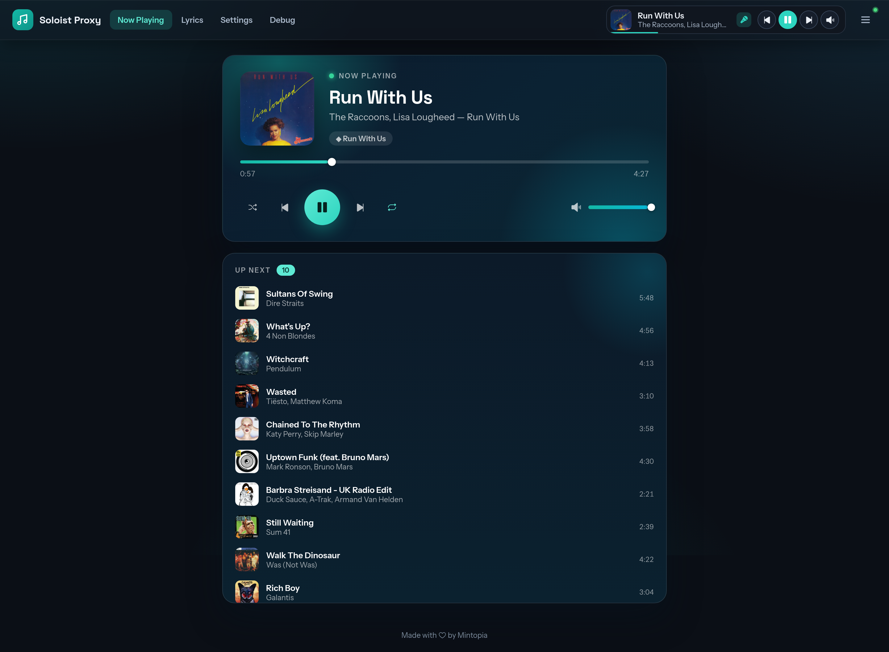
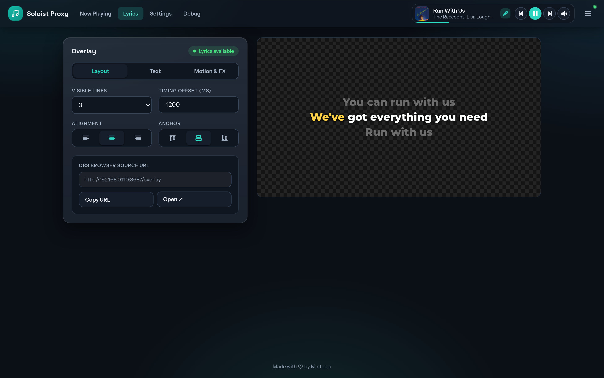
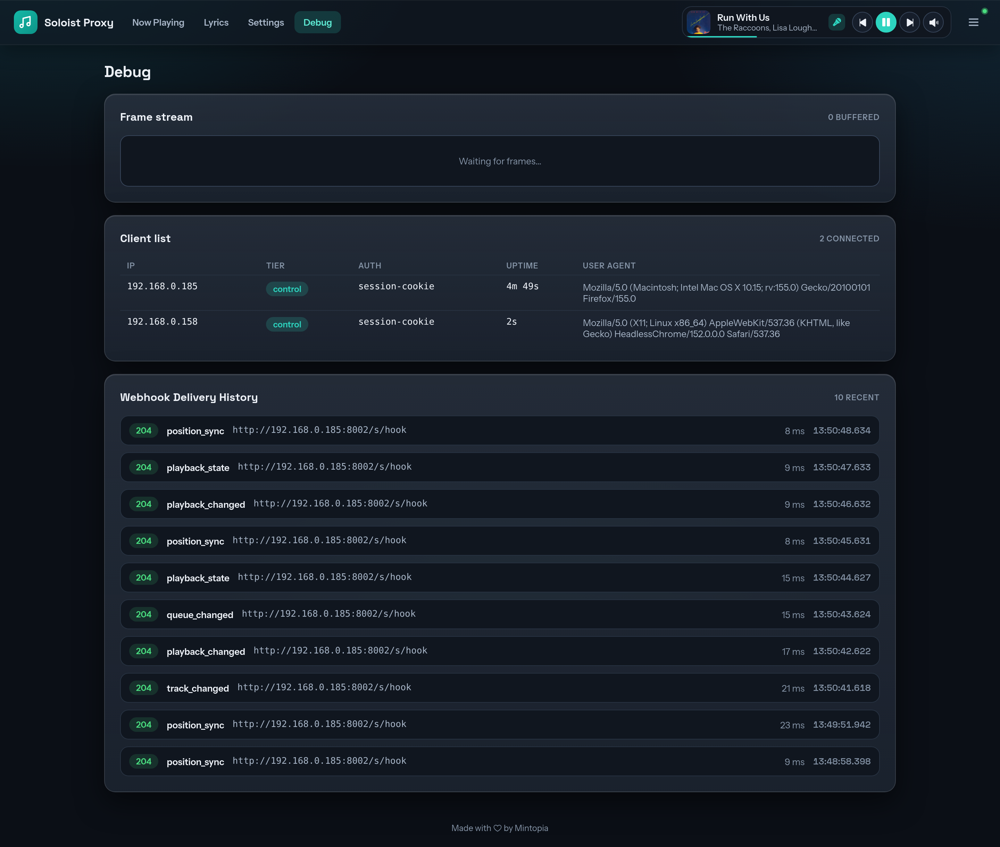

# Soloist Proxy

Soloist Proxy wraps [Spotify Soloist](https://developer.spotify.com/documentation/soloist), the official headless Linux Spotify Connect client. It adds authentication, webhook support, a web console and lyrics.

It can be run standalone using `npx` or it can be run through docker which will also provide audio device management and a snapcast server for streaming synchronised audio.

This was originally built to accompany [Music Party](https://github.com/mintopia/musicparty), which works better with a websocket providing Spotify playback events.

## Features

* **Web Console** - Configure Soloist Proxy, watch now-playing with playback controls, and get a lyrics overlay and debug info.
* **Websocket Authorisation** - Soloist's own websocket has no authentication, so Soloist Proxy lets you require a query parameter or auth header.
* **Websocket Relay** - Soloist Proxy can make an outbound websocket connection, with optional authorisation, and relay everything over it.
* **Webhooks** - Configure webhooks with a minimum interval, a secret, and hooks for particular events.
* **Lyrics** - Fetches lyrics for the current song from [LRCLIB](https://lrclib.net/) and serves an unauthenticated HTML overlay for OBS or anything that can overlay a webpage.
* **Snapcast** - The docker version bundles a [Snapcast](https://github.com/badaix/snapcast) server for streaming audio around your network.
* **Autoplay** - Start playback in Soloist automatically once it authenticates with Spotify.
* **PipeWire Included** - Soloist needs PipeWire, which most headless Linux distros don't ship. The docker version handles it for you; you just map the sound devices through.

## Screenshots



")
")


## Installation

### Docker (Linux)

The easy path. No fighting with PipeWire, and you get Snapcast too. Use a `docker-compose.yml` like this one.

```yml
services:
  soloist:
    image: ghcr.io/mintopia/musicparty-soloist:latest
    network_mode: host
    restart: unless-stopped
    devices:
      - /dev/snd:/dev/snd
    volumes:
      - /run/udev:/run/udev:ro
      - ./config:/config
      - soloist-data:/data
      - soloist-cache:/cache

volumes:
  soloist-data:
  soloist-cache:
```

The data volume is used for Soloist's data and the cache volume hosts the download of Soloist (which isn't bundled into the docker image).

`/run/udev` and `/dev/snd` are passed through to the container so it can enumerate and use ALSA audio devices in PipeWire. If you're using Snapcast, you don't need to pass those through.

`host` network mode is needed for Spotify to auto-discover the Soloist instance and authenticate it.

You can bring it up by running:

```bash
docker compose up -d
```

And now you can visit `http://<host>:8687` to access Soloist and begin setup.

### Standalone (npx)

To use this, you will need to have Node.js 24+ and configure your own PipeWire devices for audio output and there's no Snapcast server provided. Soloist will use the default PipeWire device but can be overridden in Soloist Proxy configuration.

```bash
npx @mintopia/musicparty-soloist
```

You can now visit `http://<host>:8687` and begin first-time setup.

## Usage

### Soloist API Key

The API Key authorises the Soloist. Obtain it from the [Spotify for Developers](https://developer.spotify.com) dashboard; it needs a Spotify Premium account. It does **not** log a user in. Pairing over Spotify Connect is a separate step. It is stored as `soloist.api_key` in the Config File, passed to Soloist as `--api-key`, and masked in the UI.

### First Run

1. **Authentication.** On a fresh install the panel shows a setup page. Enter a username and password.
2. **Set the Soloist API Key.** Set the API Key and Device Name. On the standalone version you can also pick your audio device here. Hit **save** and Soloist starts.
3. **Pair with Spotify.** Once Soloist is running, open Spotify on any device on the same LAN and pick your device from the Connect menu (the speaker icon).

### Ports

| Port | Service |
|------|---------|
| 8687 | Auth proxy (control WebSocket) + web UI + Lyrics Overlay |
| 1704 | Snapcast audio stream |
| 1705 | Snapcast control (TCP JSON-RPC) |
| 1780 | Snapcast web UI |

### Configuration

Most of the configuration can be done from the web panel, but you can also edit the `config.yaml` directly.

## FAQs

### Can I run this on Windows or Mac?

Not easily. The Spotify login uses Spotify Connect which requires zeroconf/mDNS on your LAN. The discovery traffic doesn't cross docker's bridge network so you need to use host networking, macvlan or ipvlan.

These aren't available on Docker Desktop for Mac or Windows which uses VMs/WSL2. If you can get the mdns broadcasts forwarded to the container, it could work. You can also try copying the session data from another deployment and it might work.

### Do I need PipeWire on a headless Linux box, and how do I run it?

Yes and no. Spotify Soloist requires PipeWire, so you need it on the host, which is honestly a pain on a headless system. Don't want to bother? Run the docker version and it'll take care of it for you, as long as you pass through the sound devices as in the `docker-compose.yml` example above.

### Is there HTTPS or TLS?

No. The proxy serves plain HTTP and WebSocket with no built-in TLS. I left it out to avoid extra config and more services in the container. If you want HTTPS, say to expose the console or overlay beyond your LAN, put a reverse proxy in front and terminate TLS there. I'd suggest [Caddy](https://caddyserver.com/) (nginx or Traefik work too); Caddy does auto-HTTPS with LetsEncrypt over ACME HTTP and DNS challenges.

### I have a valid API key, but playback says "Authentication required" and reports `logged_in: false`. What's wrong?

The API key authorises the app but doesn't log you into Spotify. To log in, open Spotify on a device on the same network (or forward mDNS broadcasts to the Soloist instance). It then shows up as a normal device you can select in Spotify.

### Why does it download Soloist on startup?

The Soloist licence from Spotify doesn't allow distribution of Soloist, and builds are only valid for 90 days, so Soloist Proxy manages this by downloading it on first run and keeping it up to date.

### What is Music Party?

[Music Party](https://github.com/mintopia/musicparty) is my collaborative jukebox intended for LAN parties. It uses Discord to authenticate users and then allows people to upvote and downvote music. It's always needed to either poll the Spotify API or use various hacky methods to get live updates from Spotify, and this solves that.

### I found a bug, what should I do?

If you find an issue with it, please raise it on the issue tracker so I can triage it and investigate it.

## AI Disclosure

AI tools (Claude, Codex) were used for writing this application.

## Links

- [Spotify Soloist](https://developer.spotify.com/documentation/soloist)
- [Snapcast](https://github.com/badaix/snapcast)
- [LRCLIB](https://lrclib.net)

## Donations

If you find this useful and want to show your thanks then [I'd appreciate it](https://github.com/sponsors/mintopia)!

If you're using the lyrics integration and finding it useful, please [check out their donations section](https://github.com/tranxuanthang/lrclib#donation) and throw them some money!

## License

The MIT License (MIT)

Copyright (c) 2026 Jessica Smith

Permission is hereby granted, free of charge, to any person obtaining a copy of this software and associated documentation files (the "Software"), to deal in the Software without restriction, including without limitation the rights to use, copy, modify, merge, publish, distribute, sublicense, and/or sell copies of the Software, and to permit persons to whom the Software is furnished to do so, subject to the following conditions:

The above copyright notice and this permission notice shall be included in all copies or substantial portions of the Software.

THE SOFTWARE IS PROVIDED "AS IS", WITHOUT WARRANTY OF ANY KIND, EXPRESS OR IMPLIED, INCLUDING BUT NOT LIMITED TO THE WARRANTIES OF MERCHANTABILITY, FITNESS FOR A PARTICULAR PURPOSE AND NONINFRINGEMENT. IN NO EVENT SHALL THE AUTHORS OR COPYRIGHT HOLDERS BE LIABLE FOR ANY CLAIM, DAMAGES OR OTHER LIABILITY, WHETHER IN AN ACTION OF CONTRACT, TORT OR OTHERWISE, ARISING FROM, OUT OF OR IN CONNECTION WITH THE SOFTWARE OR THE USE OR OTHER DEALINGS IN THE SOFTWARE.
